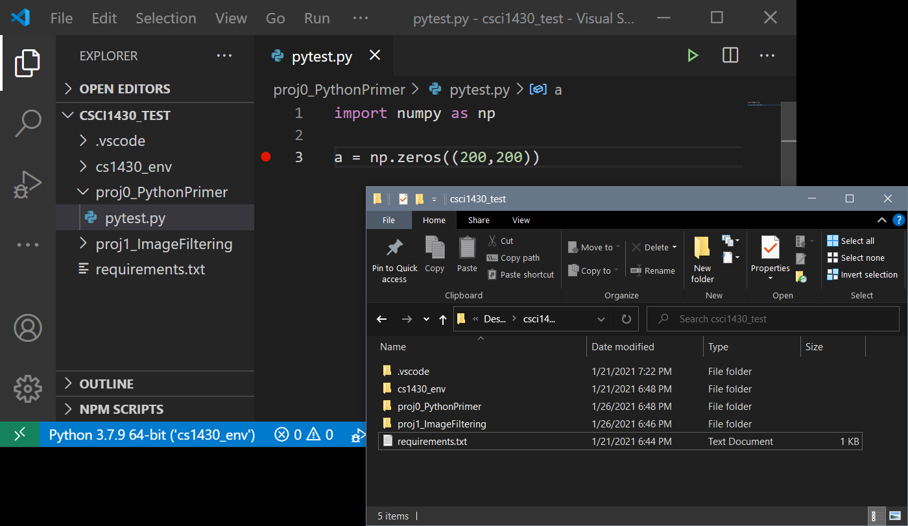
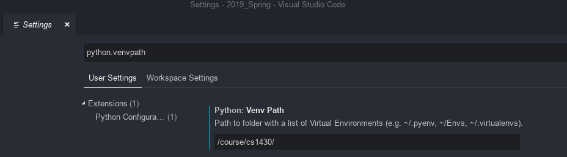
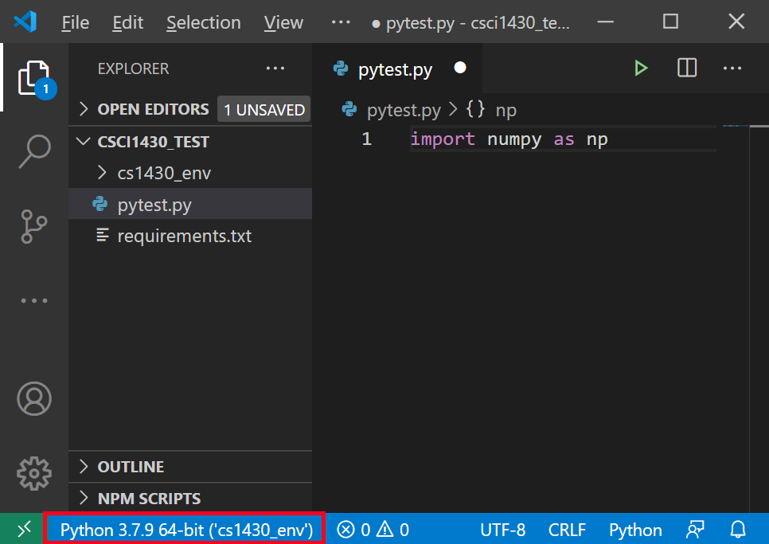

# CSCI 1410—Python Setup
Adapted from CS1430's Python Setup Installation instructions. Special thanks to Prof James Tompkin and the CS1430 TA staff. (All images from CS1430 environment, please adapt to CS1410). 


The course uses Python as our language. As software library installation and management can often be tricky, Python supports `virtual environments` which collect and isolate a set of library packages at specific version numbers. CSCI 1410 has its own virtual environment to reduce configuration issues.

You can use this virtual environment on the [CS department computers](#virtual-environment-on-department-machines), or you can recreate it on your [personal machine](#virtual-environment-on-a-personal-machine).

As a development environment, the course supports [Visual Studio Code (VSCode)](https://code.visualstudio.com/), which is a free cross-platform editor with debugging support. You are also free to use another IDE, like PyCharm&mdash;we will assume you know what you are doing, and please consider it a `drop-in' replacement in any questions or projects.


## Python Version Numbers

The class supports Python 3.7, which is the version installed on the CS department machines. Our Python virtual environment uses Python 3.7. Our Gradescope autograder uses the same virtual environment on Python 3.7.

- *Python 2.7 is not supported by the class.* 


## Virtual Environment on Department Machines

Brown CS Department machines are accessible through [FastX](https://cs.brown.edu/about/system/connecting/fastx/) and [SSH](http://cs.brown.edu/about/system/connecting/ssh/). FastX is recommended because it can show images generated by programs. SSH is sufficient for text-only uses.

If you run out of allocated disk space (which may happen for later projects with larger datasets), please send an email to <a href="#" class="cryptedmail"
    title="Email to contact Brown University technical staff, click to send email"
    data-name="problem"
    data-domain="cs.brown"
    data-tld="edu"
    onclick="window.location.href = 'mailto:' + this.dataset.name + '@' + this.dataset.domain + '.' + this.dataset.tld; return false;"></a> for more space.

On the Brown CS department machines, Python with all dependencies needed for this course is already installed. You can enable the virtual environment on department machines using the following command from the terminal:
```
$ source /course/cs1410/venv/bin/activate
```

**NOTE: The prompt will change to `(cs1410_env) $...` to show that the virtual environment is now active.**

Deactivate the environment by using the following command.
```
$ deactivate
```


## Virtual Environment on A Personal Machine

To work on a personal machine, we can recreate the `cs1410_env` locally. For this, we will use the `venv` utility to create ourselves a new Python virtual environment. 
First, make sure that you have the correct version of Python installed. You can [download version 3.7](https://www.python.org/downloads/release/python-379/). 

### On macOS and Linux
To check if Python 3.7 is installed, on Linux and macOS we can run:
```
$ python3.7 --version
```

### On Windows
**NOTE:
Windows users have had problems in the past building the virtual environment using the Windows terminal or other terminals you may have used before such as Gitbash. It is highly recommended to use the Visual Studio Code terminal built into the application to run all of your terminal commands and build your virtual environment. To access this terminal go to the "Visual Studio Code" section of this handout and install it using the link provided. Then return back to this step as you will not be able to go any further in that section without creating your virtual environment. To open a terminal in Visual Studio Code click the terminal button in the toolbar at the top and select new terminal. A terminal will then appear in the bottom window.**

On Windows, if you choose to add Python to your PATH variable on install (which isn't required), then we _could_ just call the `python` command (but...let's see why that's a bad idea):
```
> python --version
```

The alias to a specific Python version point number (e.g., `python3.7`) doesn't exist. This causes some issues if we have multiple different Python versions installed --- 2.7, 3.7, 3.8 --- which one is called when we execute `python`?! [Answer: It is the version that is first in the PATH ordering]. Thankfully, however, we can execute any Python version by using the 'launcher' command `py`. First, let's check which Python versions are installed:
```
> py --list
```

Then, we can request Python 3.7 version using:
```
> py -3.7
```

Going forward, whenever a macOS or Linux user would type `python3.7`, a Windows user would type `py -3.7` --- simple!


### Creating the virtual environment
To create your new virtual environment on your machine, navigate to a directory of your choice (for instance, this could be the directory that contains all of your cs1410 projects). Then, run:
``` 
$ python3.7 -m venv cs1410_env
```
Or, on Windows with multiple Python versions, `py -3.7 -m venv cs1410_env`.

**NOTE: Make sure that no other virtual environments are active when creating a new virtual environment.**


The command above creates a new directory called `cs1410_env` that contains your new virtual environment. You can activate this using the following command:
```
$ source ./cs1410_env/bin/activate
```

On Windows machines, you can activate the venv by running:
```
> cs1410_env\Scripts\activate
```

**NOTE 1: The prompt will change to `(cs1410_env) $...` to show that the virtual environment is now active.**

**NOTE 2: Once you've activated the virtual environment, we no longer need to call version-specific `python`s --- a call to `python` will use the correct version because 3.7 is now associated with this virtual environment.**


### Installing the required packages with Pip
Next, we need to make sure `pip` exists. Pip is a package manager that allows us to easily install Python modules. `pip` should come with your python distribution; if you don't already have pip installed on your computer, then you can follow the [official instructions](https://pip.pypa.io/en/stable/installing/).
```
(cs1410_env) $ python -m pip --version
```

**Notice that we have the virtual environment active.** When installing packages via `pip`, be sure that you are _inside_ the virtual environment, else the packages will install outside at the system-wide level and may end up conflicting.

Next, let's make sure `pip` is up-to-date by upgrading itself:
```
(cs1410_env) $ pip install --upgrade pip
```

**NOTE: You _may_ need elevated privileges to upgrade pip (e.g., sudo, or on Windows reopen VSCode using the `Run as Administrator` feature).**

So far so good. Next, let's install the required packages for the course. Please download the `requirements.txt` [file on the course website](../../requirements.txt) and save it into your projects folder. `requirements.txt` simply lists all the packages and their version numbers.
Let's use this file to install all needed libraries using the following command on your local computer:
```
(cs1410_env) $ pip install -r requirements.txt
```

*Note that this must be run while your virtual environment is activated.*

Done! Now you have a local copy of `cs1410_env`!


## Where should I put my project files in relation to the virtual environment?

On a local machine, one easy way is like this: 

```
cs1410_projects/
├── cs1410_env/
├── Project0
├── Project1
└── ...
```

We will use Github Classroom to download the files for the projects; placing them in their own directories within the same parent directory as the Python virtual environment works well for VSCode.

On a department machine, we wouldn't see the 'cs1410_env' directory as this is stored in `/course/cs1410/` instead.


## Potential Issues

### I made my own virtual environment, but Gradescope's autograder has trouble

Most probably, there's a difference between your virtual environment and ours. Please check that your project still works using the `cs1410_env` on the Brown CS department machine filesystem. Otherwise, you may lose points during grading! The autograder feedback might help you debug here.

### But I already have Python 3.x > 3.7 installed! / But I want to use Python 3.x > 3.7

In general, Python versions can exist side by side without conflicts _as long as you use virtual environments for project- or course-specific package requirements_. 
If you are experienced with Python and virtual environments, and you can resolve your own versioning issues, then please feel free to use a more current Python version on your personal machine. 
But, the code that you submit still has to pass on our autograder, and TA time will go first to helping to resolve issues from people using 3.7.

### I tried everything, but my local virtual environment still doesn't work

As a last resort, consider remotely working on a department machine through [FastX](https://cs.brown.edu/about/system/connecting/fastx/). You can directly use our official virtual environment through this option! More details are in a [previous section](#virtual-environment-on-department-machines).


## Visual Studio Code
VSCode is a GUI-based text editor and development environment. VSCode is already installed on departmental machines, and can be downloaded for local machines from the [VSCode website](https://code.visualstudio.com/).
Once installed, we're going to set up VSCode to use our virtual environment.


### Opening the projects folder

In VSCode, an easy way to have things 'just work' is to 'File -> Open Folder' your parent cs1410 projects directory:

```
cs1410_projects/
├── cs1410_env/
├── Project0_PythonPrimer
├── Project1_ImageFiltering
└── ...
```

Once opened, on a local machine VSCode will look something like this:



On a department machine, the `cs1410_env` directory would not be there; as it is stored in `/course/cs1410/`.

### Python extensions

The first time you open a Python file within VSCode, it will ask to install Python extensions. Please do that!


### Setting path to Python.VenvPath:
1. Open the settings window with Cmd + "," (Mac) or Ctrl + "," (Windows)
2. Search for Python.VenvPath as shown in the picture below:



- If you are using VSCode on a department machine, please set the application variable `Python.VenvPath` to `/course/cs1410/` in your VSCode settings to correctly detect our Python virtual environment. This is the _parent directory of_ the virtual environment.

- If you are using VS Code on your own machine, first please make sure that the [Python VS Code plugin](https://marketplace.visualstudio.com/items?itemName=ms-python.python) is installed. 
Then you can set `Python.VenvPath` to _the parent directory of_ whichever directory contains your [virtual environment](#working-locally). Why the parent? VSCode expects you to have multiple virtual environments for each of your different Python projects (say, different courses at Brown), and it expects you to put them all in the same directory. Pointing it to the parent directory lets it scan and find all these expected different virtual environments, and then for you to easily toggle between them in the interface.

Then, restart VSCode. 
Once done, open a Python file, look to the bottom right, and we should see `Python 3.7.9 64-bit ('cs1410_env')`. It's actually a button --- if we click it, we see a list of Python environments installed on our machine --- make sure the `cs1410_env` one is selected and that it is in the expected path/directory.




## Optional: Alias Setup
On macOS or Linux, you may wish to create an alias for the environment activation command to make it easier to type and remember. To do this you need to edit your `.bash_profile` file (located in your home directory). Note that the `.bash_profile` file may be hidden from the file explorer depending on your settings, but can still be opened with a command-line text editor like `nano`:

1. Run `nano ~/.bash_profile`; if this file does not exist, you can create it with the command `touch ~/.bash_profile`
2. Paste this line at the bottom of the file:
```
alias cs1410_env="source [PATH_TO_VENV]/bin/activate"
```

3. Save the file by first hitting `ctrl + x`, then type `Y`, then press `enter`.
4. If you are on a Mac, you may need to add `source ~/.bash_profile` to your `~/.zshrc` config file
    * run `nano ~/.zshrc`
    * add `source ~/.bash_profile` to the file
    * Save the file by first hitting `ctrl + x`, then type `Y`, then press `enter`.
    * Restart the terminal or run `source ~/.zshrc`
5. Restart the terminal


Now, you can activate your virtual environment in the terminal by running `cs1410_env`. **Note**: The alias will not take effect until you restart (close and open) the terminal or run `source ~/.bashrc` (`source ~/.zshrc` for Macs). 


## Made it this far?

If you want to learn more about actually using Python, [check out our guide](../python_tutorial)!

